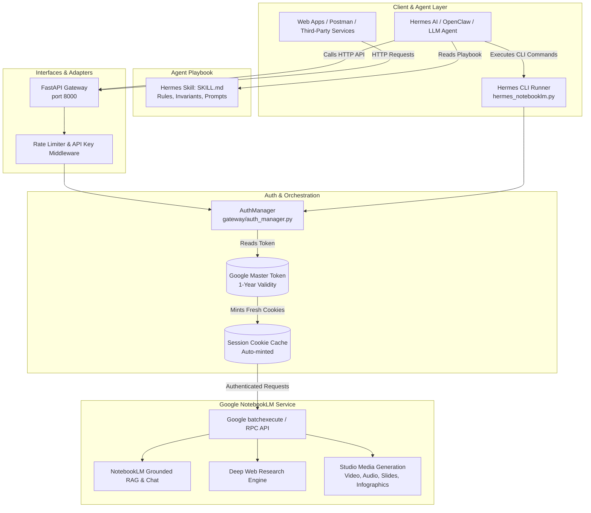

# MEMORY.md: NotebookLM Autonomous Enterprise System & Hermes AI VPS Skill

**Status:** Active & Production Ready  
**Last Updated:** September 2026  
**Primary Architect:** Antigravity Pair-Programming  
**Target Environment:** Local Workstations (Windows/macOS/Linux) & Hermes AI VPS (Ubuntu Linux)  

---

## 1. Executive Summary & Purpose

This repository houses a **production-grade, autonomous automation platform for Google NotebookLM**, paired with a native cognitive skill for **Hermes AI** and a high-performance **FastAPI REST Gateway**.

### Key Problem Solved
Traditional browser-based automation and unofficial Google scripts break after 2 to 24 hours because Google session cookies expire quickly.  
**Solution:** This project utilizes an **underlying Google Master Token** (`aas_et/` OAuth token), which remains valid for **up to 1 full year** without interactive logins. The authentication engine automatically and silently mints fresh temporary cookies in-process, allowing continuous, headless background operation on remote VPS instances and CLI agents.

---

## 2. Current Project State & Milestones (Which Step We Are At)

| Milestone / Component | Status | Details |
|---|---|---|
| **Underlying Engine (`src/notebooklm`)** | **Completed** | Full typed async Python API supporting NotebookLM's internal RPC/batchexecute protocol. |
| **Authentication Engine** | **Completed & Live** | Master token generated and verified for `sammodak.works@gmail.com`. Valid through **September 3, 2027**. |
| **FastAPI REST Gateway (`gateway/`)** | **Completed** | Complete REST microservice with rate limiting, SQLite API key management, and direct binary media streaming. |
| **Direct Media Streaming** | **Completed** | Endpoints to stream and download generated MP4 videos, PDF slide decks, and audio files directly. |
| **Hermes AI Cognitive Skill (`hermes/skills/notebooklm/SKILL.md`)** | **Completed** | Production prompt instructions giving Hermes AI full decision-making abilities for research, QA audits, and media dispatch. |
| **Hermes CLI Runner (`hermes/hermes_notebooklm.py`)** | **Completed** | Unified CLI tool with commands for notebook CRUD, source ingestion, deep web research, quality auditing, studio generation, and one-click pipelines. |
| **Live Account Verification** | **Verified** | Live queries tested against notebook `Real_chack` (`e8ce698c-71f9-4e25-83b3-4ae98e84df91`). |
| **Git Repositories Synced** | **Synced & Up-to-Date** | Synced to both `git@github.com:Somnathmodak25/Notebooklm_auto.git` and `git@github.com:Somnathmodak25/Notebooklm_auto_create.git`. |
| **Current Step** | **Phase 5: Operational Readiness** | Ready for deployment to Hermes VPS or immediate local autonomous execution. |

---

## 3. High-Level Architecture & Data Flow



---

## 4. Repository Structure & File Index

To avoid inspecting files one by one, use this directory map:

```
Notebooklm_auto/
├── .env.example                  # Template configuration for Gateway & environment
├── .gitignore                    # Git hygiene (strictly excludes secrets, tokens, db, media)
├── AGENTS.md                     # Antigravity / coding assistant conventions & guidelines
├── DEPLOYMENT.md                 # Production deployment runbook for Ubuntu/Debian VPS
├── README.md                     # Public documentation and feature overview
├── SKILL.md                      # Root skill specification
├── memory.md                     # Single source of truth for the entire system
├── pyproject.toml                # Dependencies, packaging, and build definitions
├── gateway/                      # Production FastAPI REST microservice
│   ├── main.py                   # App initialization, CORS, lifespan, routes mounting
│   ├── models.py                 # Pydantic V2 schemas for requests & responses
│   ├── auth_manager.py           # Multi-session token & client lifecycle management
│   ├── api_keys.py               # SQLite-backed hashed API key management
│   ├── middleware.py             # Sliding-window rate limiter
│   └── routes/                   # Route controllers
│       ├── notebooks.py          # Notebook CRUD (list, create, get, rename, delete)
│       ├── sources.py            # Knowledge ingestion (URLs, raw text, file uploads)
│       ├── chat.py               # Grounded Q&A against notebook sources
│       ├── studio.py             # Studio media creation, status polling & direct streaming
│       └── admin.py              # API key provisioning, revocation, and metrics
├── hermes/                       # Hermes AI integration suite
│   ├── hermes_notebooklm.py      # Unified CLI runner and programmatic client
│   └── skills/notebooklm/        # Cognitive skill package for Hermes
│       └── SKILL.md              # Deep decision engine and operational instructions
├── storage/                      # Local persistent data directory
│   ├── tokens/                   # Master token storage (.gitkept, secrets ignored by git)
│   │   ├── master_token.json     # Primary Google Master Token (valid to Sep 2027)
│   │   └── main_storage_state.json # Silently auto-refreshed session cookies
│   └── db/                       # SQLite databases (.gitkept, data ignored by git)
│       └── gateway.db            # API keys and rate limit logs
├── scripts/                      # Utility and test scripts
│   ├── test_gateway_e2e.py       # End-to-end verification script for Gateway API
│   ├── test_studio.py            # Live test script for Studio generation
│   ├── verify_live.py            # Quick pre-flight live connectivity check
│   ├── push_to_github.bat        # Windows one-click Git push script
│   └── push_to_github.sh         # Linux/macOS one-click Git push script
└── src/notebooklm/               # Core Python NotebookLM protocol engine
```

---

## 5. What the System Can Do (Full Capabilities)

### 1. Notebook Lifecycle Management
- Create fresh dedicated notebooks for any topic.
- List all notebooks on the Google account.
- Retrieve full metadata, source counts, and note entries.
- Rename notebooks dynamically.
- Cleanly delete notebooks.

### 2. High-Density Knowledge Ingestion
- **Web URLs:** Ingest articles, documentation, arXiv preprints, Wikipedia entries, and blog posts.
- **Raw Text / Markdown:** Ingest custom synthetic data, research briefings, or user notes directly.
- **Local Files:** Upload PDFs, TXT, MD, and CSV files directly into the notebook context.

### 3. Grounded Factual RAG & Chat
- Query the notebook using natural language prompts.
- Answers are strictly grounded in ingested sources with full citation attribution.
- Multi-turn conversation capability.

### 4. Autonomous Fast & Deep Web Research
- **Fast Mode:** Quick web search and summary generation.
- **Deep Mode:** Comprehensive multi-stage web search that automatically crawls, synthesizes, and injects external findings into the notebook as a curated source.

### 5. Research Quality & Gap Verification (`verify-quality`)
- Evaluates the factual depth and coverage of the notebook.
- Identifies knowledge blind spots, missing viewpoints, or contradictions.
- Calculates an objective readiness score (1–10) before committing to costly Studio generations.

### 6. Full Studio Media Generation
- **Video Overview / Cinematic Presentation:** Produces AI-generated documentary and explainer videos complete with visual slides, motion transitions, and voiceover.
- **Audio Overview (Podcast):** Generates dual-host conversational podcast episodes discussing the notebook sources.
- **Slide Decks & Infographics:** Creates visual summary presentations and structured slide decks.
- **Study Guides & Briefing Docs:** Automatically drafts executive briefings, study guides, and FAQ sheets.

### 7. Direct Binary Media Streaming & Export
- The FastAPI gateway features dedicated download endpoints (`/studio/video/download`, `/studio/slide-deck/download`, `/studio/audio/download`).
- Streams media files directly to the caller as binary streams (`video/mp4`, `application/pdf`, `audio/mp3`) with auto-saving to local disks.

### 8. End-to-End Pipeline Execution (`pipeline`)
- A single command executes the entire lifecycle:
  `Topic Prompt` $\rightarrow$ `Create Notebook` $\rightarrow$ `Ingest Base Context` $\rightarrow$ `Run Deep Web Research` $\rightarrow$ `Audit Quality` $\rightarrow$ `Generate Video/Audio`.

---

## 6. Authentication Architecture: Master Token vs. Cookies

### Why Standard Cookies Fail
Standard NotebookLM cookies (`__Secure-1PSID`, `SAPISID`, etc.) expire within hours or days and change whenever browser sessions close.

### How the Master Token Works
1. Google issues a long-lived OAuth Master Token (`aas_et/...`) via Google Play Services / Android OAuth flow.
2. The file is saved at `~/.notebooklm/profiles/default/master_token.json` or `storage/tokens/master_token.json`.
3. When the client initializes, `AuthManager` reads the master token and contacts Google's token exchange endpoint:
   ```
   https://android.clients.google.com/auth
   ```
4. It exchanges the master token for fresh, temporary browser session cookies on demand.
5. If Google rejects a session cookie mid-run with HTTP 401/403, the client detects the expiration, requests fresh cookies via the master token, and retries seamlessly.
6. **Token Expiration Date:** The current active token is valid until **September 3, 2027 (1 full year)**.

> [!NOTE]
> **About `.lock` Files:** When running multi-process or multi-threaded workloads, you may see 0-byte files like `.master_token.json.lock`. These are temporary OS file locks used by Python's `filelock` library to prevent race conditions during cookie rotation. They contain no secrets and are completely normal.

---

## 7. Hermes CLI Reference (`hermes/hermes_notebooklm.py`)

Run commands using Python with the module path:

```bash
# General Syntax
python hermes/hermes_notebooklm.py <command> [options]
```

### Commands Table

| Command | Arguments / Flags | Description |
|---|---|---|
| `list` | *none* | Lists all notebooks with titles, IDs, source counts, and update times. |
| `create` | `--title <str>` | Creates a new notebook with the given title and returns its ID. |
| `get` | `--notebook-id <uuid>` | Retrieves full details, sources, and notes for a specific notebook. |
| `add-source` | `--notebook-id <uuid>`<br>`--type [url\|text\|file]`<br>`--content <str>`<br>`--title <str>` | Ingests a new source (web URL, raw text string, or local file path). |
| `research` | `--notebook-id <uuid>`<br>`--query <str>`<br>`--mode [fast\|deep]` | Triggers autonomous web research on a topic and adds findings to the notebook. |
| `verify-quality`| `--notebook-id <uuid>` | Performs a grounded chat audit to score knowledge depth and spot missing topics. |
| `studio` | `--notebook-id <uuid>`<br>`--type [video\|audio\|slide_deck\|infographic]`<br>`--prompt <str>`<br>`--output-dir <path>` | Dispatches studio generation, polls until completion, and downloads media to disk. |
| `pipeline` | `--topic <str>`<br>`--target [video\|audio\|slides]`<br>`--output-dir <path>` | Executes full end-to-end workflow from blank prompt to final media file. |

### CLI Examples

```bash
# 1. List existing notebooks
python hermes/hermes_notebooklm.py list

# 2. Create a research notebook
python hermes/hermes_notebooklm.py create --title "Quantum Computing 2026"

# 3. Ingest a web article
python hermes/hermes_notebooklm.py add-source \
  --notebook-id "e8ce698c-71f9-4e25-83b3-4ae98e84df91" \
  --type url \
  --content "https://en.wikipedia.org/wiki/Quantum_computing"

# 4. Run deep web research
python hermes/hermes_notebooklm.py research \
  --notebook-id "e8ce698c-71f9-4e25-83b3-4ae98e84df91" \
  --query "Top breakthroughs in fault-tolerant quantum error correction 2026" \
  --mode deep

# 5. Audit knowledge quality
python hermes/hermes_notebooklm.py verify-quality \
  --notebook-id "e8ce698c-71f9-4e25-83b3-4ae98e84df91"

# 6. Generate and download a documentary video
python hermes/hermes_notebooklm.py studio \
  --notebook-id "e8ce698c-71f9-4e25-83b3-4ae98e84df91" \
  --type video \
  --prompt "Create a fast-paced executive video briefing explaining quantum error correction" \
  --output-dir ./media

# 7. One-click autonomous pipeline
python hermes/hermes_notebooklm.py pipeline \
  --topic "The Future of Solid State Batteries" \
  --target video \
  --output-dir ./media
```

---

## 8. FastAPI REST API Reference (`gateway/`)

The Gateway runs by default at `http://127.0.0.1:8000`. Full interactive documentation is available at `http://127.0.0.1:8000/docs`.

### Authentication Headers
- Admin endpoints require: `Authorization: Bearer <ADMIN_TOKEN>`
- Regular endpoints require: `X-API-Key: <api_key>` (or `Authorization: Bearer <api_key>`)

### API Endpoints Summary

| Method | Endpoint | Description |
|---|---|---|
| `GET` | `/health` | Health check reporting service status, database connectivity, and timestamp. |
| `GET` | `/notebooks` | List all notebooks. |
| `POST` | `/notebooks` | Create a new notebook (`{"title": "..."}`). |
| `GET` | `/notebooks/{id}` | Get notebook details, sources, and notes. |
| `PATCH`| `/notebooks/{id}` | Rename a notebook (`{"title": "..."}`). |
| `DELETE`| `/notebooks/{id}`| Delete a notebook. |
| `POST` | `/sources/url` | Add a web URL as a source (`{"notebook_id": "...", "url": "..."}`). |
| `POST` | `/sources/text` | Add raw text/markdown (`{"notebook_id": "...", "title": "...", "content": "..."}`). |
| `POST` | `/sources/upload`| Upload a file (multipart form data). |
| `POST` | `/chat` | Grounded RAG query (`{"notebook_id": "...", "query": "..."}`). |
| `POST` | `/studio/research` | Trigger web research (`{"notebook_id": "...", "query": "...", "mode": "deep"}`). |
| `POST` | `/studio/audio` | Generate audio podcast episode. |
| `POST` | `/studio/video` | Generate documentary/presentation video. |
| `POST` | `/studio/slide-deck` | Generate visual slide deck presentation. |
| `GET` | `/studio/tasks/{task_id}` | Poll generation task status (queued, running, completed). |
| `GET` | `/studio/video/download` | **Direct stream / download of MP4 video file.** |
| `GET` | `/studio/slide-deck/download`| **Direct stream / download of PDF slide deck.** |
| `GET` | `/studio/audio/download` | **Direct stream / download of MP3 audio podcast.** |
| `POST` | `/admin/keys` | Generate a new API key with specific role (`read`, `write`, `admin`). |
| `GET` | `/admin/keys` | List all provisioned API keys and their usage counts. |
| `DELETE`| `/admin/keys/{prefix}` | Revoke an API key. |

---

## 9. Hermes AI Skill Integration (`hermes/skills/notebooklm/SKILL.md`)

The cognitive skill teaches Hermes AI how to act like an autonomous research analyst:

1. **Pre-flight Check:** Automatically verifies the master token before executing heavy jobs.
2. **UUID Tracking:** Retains notebook IDs across multi-turn agent conversations without asking the user.
3. **Context Verification:** Never calls Video or Slide generation on a thin notebook (demands $\ge 3$ sources and a QA score $\ge 8/10$).
4. **Autonomous Remediation:** If quality audit highlights missing topics, Hermes autonomously executes supplementary web research before triggering Studio generation.
5. **Asynchronous Polling:** Polls task status non-blockingly, then downloads artifacts directly to `media/` directory.

To install this skill into Hermes VPS:
```bash
mkdir -p ~/.hermes/skills/notebooklm
cp hermes/skills/notebooklm/SKILL.md ~/.hermes/skills/notebooklm/SKILL.md
```

---

## 10. Quickstart Guide (Local & VPS)

### Local Execution (Windows / macOS / Linux)

```powershell
# 1. Activate Virtual Environment
.venv\Scripts\activate   # (Linux/macOS: source .venv/bin/activate)

# 2. Check Authentication
python -m notebooklm.notebooklm_cli auth check --test --json

# 3. Start the FastAPI Gateway
python -m uvicorn gateway.main:app --host 127.0.0.1 --port 8000 --reload

# 4. Or use the Hermes CLI directly
python hermes/hermes_notebooklm.py list
```

### VPS Deployment (Ubuntu / Debian)

Full production guide is in `DEPLOYMENT.md`. Summary:

```bash
# 1. Clone repository on VPS
git clone https://github.com/Somnathmodak25/Notebooklm_auto.git
cd Notebooklm_auto

# 2. Set up Python virtual environment
python3 -m venv .venv
source .venv/bin/activate
pip install -e ".[headless,server]"
pip install aiosqlite redis uvicorn

# 3. Copy your Master Token from local machine to VPS
# (SCP or SFTP ~/.notebooklm/profiles/default/master_token.json to VPS ~/.notebooklm/profiles/default/)
mkdir -p ~/.notebooklm/profiles/default
scp ~/.notebooklm/profiles/default/master_token.json user@vps_ip:~/.notebooklm/profiles/default/

# 4. Run Gateway via systemd or tmux
python3 -m uvicorn gateway.main:app --host 0.0.0.0 --port 8000
```

---

## 11. Security, Git Hygiene & Cleanup Rules

- **Tokens & Secrets:** Never commit `.env`, `storage/tokens/*.json`, `storage/db/*.db`, or browser profiles to Git.
- **Git Repositories:**
  - `origin`: `git@github.com:Somnathmodak25/Notebooklm_auto_create.git`
  - `notebooklm_auto` / `my_origin`: `git@github.com:Somnathmodak25/Notebooklm_auto.git`
- **Clean State:**
  - Browser profile caches (`GraphiteDawnCache`, `GrShaderCache`, etc.) are stripped.
  - Temporary lock files (`*.lock`) are ignored and stripped.
  - Only tracked production code and `.gitkeep` files are committed.
